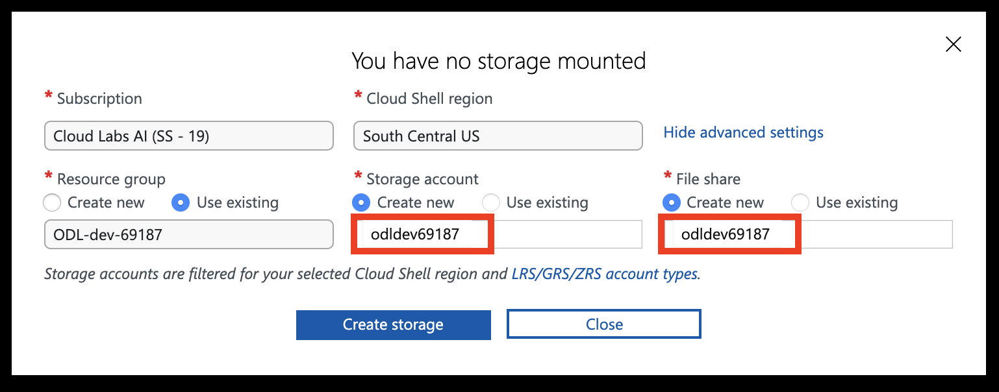

# The AKS Workshop

## Introduction

Welcome to the Azure Kubernetes Workshop. In this lab, you'll go through tasks that will help you master the basic and more advanced topics required to deploy a containerized application to Kubernetes on [Azure Kubernetes Service (AKS)](https://azure.microsoft.com/en-us/services/kubernetes-service/).

You can use this guide as a Kubernetes tutorial and as study material to help you get started learning Kubernetes.

Some things you’ll be going through:

- Containerizing an application and running it locally
- Customizing the app using environment variables
- Deploying the app to AKS and accessing it publicly
- Monitoring the app with Azure Monitor

The lab will also include optional sections to dive deeper into the following topics:

- Detecting cost optimization opportunities
- Handling load spikes

## Prerequisites

### Tools

This course is entirely explained from a Linux environment (on Windows, a quick win can be to [go with the Windows Linux Subsystem](https://learn.microsoft.com/en-us/windows/wsl/install) or [Git BASH](https://gitforwindows.org)).

You can use [the Azure Cloud Shell service](https://shell.azure.com) once you log in with an Azure subscription. The Azure Cloud Shell has the Azure CLI pre-installed and configured to connect to your Azure subscription, as well as [kubectl](https://github.com/kubernetes/kubectl) and [Helm](https://github.com/helm/helm).

Alternatively, you need to meet the following requirements:

- [Azure CLI](https://github.com/Azure/azure-cli) v2.53.0
- [Docker CLI](https://github.com/docker/cli) v24.0.1, with [Docker Desktop](https://www.docker.com/products/docker-desktop), or, for licensing-related issues, use [Podman](https://github.com/containers/podman) and [Podman Desktop](https://github.com/containers/podman-desktop)
- [Helm](https://github.com/helm/helm) v3.11.1
- [kubectl](https://github.com/kubernetes/kubectl) v0.26.X
- [Kubernetes](https://kubernetes.io) v1.26 (managed from [Azure Kubernetes Service](https://learn.microsoft.com/en-us/azure/aks))

### Azure subscription

#### If you have an Azure subscription

<details>
<summary>Watch solution</summary>

Please consider using your username and password to login into [the Azure Portal](https://portal.azure.com). Also, please authenticate your Azure CLI by running the command below on your machine and following the instructions.

```sh
az account show
az login
```

</details>

#### Azure Cloud Shell

You can use the Azure Cloud Shell accessible at <https://shell.azure.com> once you log in with an Azure subscription.

<details>
<summary>Watch solution</summary>

Head over to <https://shell.azure.com> and sign in with your Azure Subscription details.

Select **Bash** as your shell.


Select **Show advanced settings**


Set the **Storage account** and **File share** names to your resource group name (all lowercase, without any special characters), then hit **Create storage**



You should now have access to the Azure Cloud Shell


</details>

#### Tips for uploading and editing files in Azure Cloud Shell

- You can use `code <file you want to edit>` in Azure Cloud Shell to open the built-in text editor.
- You can upload files to the Azure Cloud Shell by dragging and dropping them
- You can also do a `curl -o filename.ext https://file-url/filename.ext` to download a file from the internet.

## Container and Kubernetes basics

In this lab, you will be creating and deploying containers.

To ensure a smooth experience, please familiarize yourself beforehand with container basics using [Docker introduction on MS Learn](https://learn.microsoft.com/en-us/dotnet/architecture/microservices/container-docker-introduction/). Alternatively, you can check [Docker's Get started guide](https://docs.docker.com/get-started/).

If you are keen to explore the advanced optional sections, we strongly encourage you to have some prior knowledge of Kubernetes and its concepts. If you are new to Kubernetes, start with the [Kubernetes Learning Path](https://aka.ms/LearnKubernetes) to learn Kubernetes basics, then go through the concepts of [what Kubernetes is and what it isn't](https://aka.ms/k8sLearning).

If you are a more experienced Kubernetes developer or administrator, you may have a look at the [Kubernetes best practices ebook](https://aka.ms/aks/bestpractices).

## Application Overview

You will be deploying a web application that is containerized, served from AKS, and publicly accessible.

Further optional sections will extend this application with additional features using a microservice architecture.

Useful resources are provided to help you work through each task. If you're working through this as part of a team-based exercise, ensure you make progress at a good pace by dividing the workload between team members when possible. This may require work that might be needed in a later task.

<div class="tip" data-title="Tip">

> If you get stuck, you can ask for help from the proctors. You may also choose to peek at the solutions.

</div>

### Core tasks

Running through this as part of a half-day workshop, you should be able to complete the **Getting up and running** section. This involves setting up a Kubernetes cluster, deploying the application container from Azure Container Registry, and setting up monitoring.

### Optional tasks

Once you're done with the core tasks, the next challenge would be to dive deeper into advanced topics. **Complete as many tasks as you can**. You'll be setting up advanced monitoring, deploying multiple microservices, enforcing security, and adding more resilience to your cluster.

---

# Getting up and running

## Running the application within a Docker container (25m)

In this challenge, you will add a Dockerfile to a web application, build it, and run it using a Docker container. You must understand how to build container images before using an orchestrator such as Kubernetes. The build of the image must be done on your computer and Docker must be installed and running.

#### Get the `webapp` source code

Download the `webapp` from the Github repository: [hello-worlds.zip](https://github.com/lgmorand/aks-workshop/raw/main/sample-app/hello-worlds.zip)

<details>
<summary>Watch solution</summary>

```sh
wget -O hello-worlds.zip https://github.com/lgmorand/aks-workshop/raw/main/sample-app/hello-worlds.zip
unzip hello-worlds.zip
cd hello-worlds
cd nodejs
```

</details>

#### Build a Docker image

To run the app in Docker, you need to add a [Dockerfile](https://docs.docker.com/build/building/packaging/#dockerfile) describing how the app will be built and run.

Create a new file named `Dockerfile` at the root of the app code and fill it with instructions on how to build and run the app.

<div class="tip" data-title="Tip">

> Refer to Docker's [language-specific guide](https://docs.docker.com/language/)

</div>


<details>
<summary>Watch solution</summary>

```dockerfile
FROM node:lts

ENV NODE_ENV=production

# Copy app code and install dependencies
WORKDIR /app
COPY ["package.json", "package-lock.json*", "./"]
RUN npm ci
COPY . .

# Start the app
EXPOSE 80
CMD [ "node", "server.js" ]
```

</details>

Now that you have a Dockerfile, you need to use it to build a Docker image.

Use `docker build` to create the image.

<details>
<summary>Watch solution</summary>

```sh
# Run this command in the root of the nodejs directory, where you created a Dockerfile
docker build -t webapp .
```

</details>

> Warning: if you get an error message telling that you can't connect to the docker daemon. either start Docker app locally (start Menu) or start your shell with elevated privileges (administrator). "Cannot connect to the Docker daemon at unix:///var/run/docker.sock. Is the docker daemon running?

#### Run the app

Use `docker run` to start a new container from the image you have just created. Use the port 9000 for your test (or any available one).

<details>
<summary>Watch solution</summary>

```sh
# Use the port 9000 to serve the app
docker run -it -p 9000:80 webapp
```

</details>

Finally, load the app URL [http://localhost:9000](http://localhost:9000) in a browser and make sure you see a `Hello world` message.

<div class="info" data-title="Resources">

> * <https://docs.docker.com/get-started/02_our_app/>
> * <https://docs.docker.com/language/>
> * <https://docs.docker.com/engine/reference/builder/>

</div>


## Customizing the containerized app (5m)


In this challenge, you will customize the behavior of the web app container using environment variables without having to re-create the Docker image.

#### Customize the app with environment variables

Customize the output of the app without rebuilding the Docker image to have the following changes:

- return `hello Docker` instead of `hello world`
- set the header `X-Version` to `1.0.0`
- set the header `X-Environment` to `test`

<details>
<summary>Watch solution</summary>

```sh
docker run -it -p 9000:80 -e "GREETEE=Docker" -e "VERSION=1.0.0" -e "ENVIRONMENT=test" webapp
```

</details>

<div class="info" data-title="Note">

> While you can customize the behaviour of containers using arguments (build), environment variables (runtime), volumes (runtime), and network calls (runtime), the deployment envrironment is usually set with an environment variable and the app version is usually set using an argument.

</div>


<div class="info" data-title="Resources">

> - <https://docs.docker.com/engine/reference/run/>

</div>


## Publishing to a Docker registry (15m)


Azure provides [ACR](https://learn.microsoft.com/en-us/azure/container-registry/) (Azure Container Registry), a service to host container images.

You will use ACR to store and distribute the container image that you have built in the previous challenges.

#### Create a Resource Group

Create a resource group, which will be used to create the registry and the Kubernetes cluster (in the next challenge).

<details>
<summary>Watch solution</summary>

Use `az account list-locations` to get a location:

```sh
az account list-locations -o table
```

Then create the resource group using the selected location:

```sh
az group create --name <resource-group> --location <region>
```

</details>

#### Create a Container Registry

Create a container registry in the new resource group.

<details>
<summary>Watch solution</summary>

```sh
# Create the registry
az acr create --resource-group <resource-group> --name <registry-name> --sku Basic

# List available registries
az acr list --resource-group <resource-group> --output table
```

</details>

#### Publish the app image

Publish the web app image to the new registry.

<div class="info" data-title="Note">

> Check the `Quick start` in the navigation menu of your Container Registry.

</div>


<details>
<summary>Watch solution</summary>

```sh
# Login to the docker registry
az acr login -n <registry-name>

# Tag the existing image with a new registry tag
docker tag webapp <registry-name>.azurecr.io/webapp

# Publish the image
docker push <registry-name>.azurecr.io/webapp
```

</details>

Ensure you can pull the image that you have published in the new registry.

<details>
<summary>Watch solution</summary>

```sh
# Pull the image
docker pull <registry-name>.azurecr.io/webapp
```

</details>

<div class="info" data-title="Resources">

> * <https://learn.microsoft.com/en-us/azure/container-registry/>
> * <https://learn.microsoft.com/en-us/azure/container-registry/container-registry-get-started-docker-cli?tabs=azure-cli/>

</div>


## Deploying Kubernetes with AKS (30m)


Azure has a managed Kubernetes service, AKS (Azure Kubernetes Service), you will use this to easily deploy a Kubernetes cluster.

#### Get the latest Kubernetes version available in AKS

You can either let Azure choose the default version of kubernetes for you or you can specify the version during the creation of the cluster. To know which version of kubernetes is supported in your region, use the command `az aks get-versions`

<details>
<summary>Watch solution</summary>

Get the latest available Kubernetes version in your preferred region and store it in a bash variable. Replace `<region>` with the region of your choosing, for example `eastus`.

```sh
version=$(az aks get-versions -l <region> --query 'values[] | [0].version' -o tsv)
```

The command above returns the newest version of Kubernetes available to deploy using AKS. Newer Kubernetes releases are typically made available in “Preview”. To get the latest non-preview version of Kubernetes, use the following command instead.

```sh
version=$(az aks get-versions -l <region> --query 'values[?isPreview == null].[version][0]' -o tsv)
```

</details>

#### Create the AKS cluster

**Task Hints**

* It's recommended to use the Azure CLI and the `az aks create` command to deploy your cluster. Refer to the docs linked in the Resources section, or run `az aks create -h` for details
* The size and number of nodes in your cluster is not critical, but two or more nodes of type `Standard_DS2_v2` or larger is recommended
* Make sure to enable the [http_application_routing add-on](https://learn.microsoft.com/en-us/azure/aks/http-application-routing) when creating the cluster to simplify networking settings in the next challenges
* You should give the cluster access to the container registry by “attaching” it
* You can optionally create AKS clusters that support the [cluster autoscaler](https://docs.microsoft.com/en-us/azure/aks/cluster-autoscaler#about-the-cluster-autoscaler). We will focus more on this in the advanced sections

Create AKS using the latest version

<details>
<summary>Watch solution</summary>

```sh
az aks create \
  --resource-group <resource-group> \
  --name <unique-aks-cluster-name> \
  --location <region> \
  --kubernetes-version $version \
  --generate-ssh-keys \
  --node-count 2 \
  --generate-ssh-keys \
  --node-vm-size Standard_DS2_v2 \
  --network-plugin azure \
  --enable-addons http_application_routing \
  --attach-acr <registry-name>

az aks nodepool add \
  --resource-group <resource-group> \
  --cluster-name <unique-aks-cluster-name> \
  --name userpool \
  --node-count 2 \
  --node-vm-size Standard_B2s
```

The userpool is used to isolate the pods you will create from the default one managed by the Kubernetes system and you should see something like this:


<div class="info" data-title="Note">

> * You can optionally enable the autoscaler using the options `--enable-cluster-autoscaler`, `--min-count`, and `--max-count` in `az aks create`.
> * You can attach an ACR registry to an existing AKS cluster using `az aks update -n <cluster-name> -g <resource-group> --attach-acr <registry-name>`

</div>


</details>

#### Ensure you can connect to the cluster using `kubectl`

**Task Hints**

* `kubectl` is the main command line tool you will use for working with Kubernetes and AKS. It is already installed in the Azure Cloud Shell
* Refer to the AKS docs, which includes [a guide for connecting kubectl to your cluster](https://docs.microsoft.com/en-us/azure/aks/kubernetes-walkthrough#connect-to-the-cluster) (Note: if you are using the Azure Cloud Shell you can skip the `install-cli` step because `kubectl` is already installed).
* A good sanity check is listing all the nodes in your cluster `kubectl get nodes`.
* [This is a good cheat sheet](https://kubernetes.io/docs/reference/kubectl/cheatsheet/) for kubectl.

<details>
<summary>Watch solution</summary>

Authenticate against the cluster. The `az aks get-credentials` connect to the cluster and create a local kubeconfig file which will be used by `kubectl` to connect to the cluster.

```sh
az aks get-credentials --resource-group <resource-group> --name <unique-aks-cluster-name>
```

List of the available nodes

```sh
kubectl get nodes
```

<div class="info" data-title="Note">

> If `kubectl` has some issues to connect to your cluster, you can run the command:
> `export KUBECONFIG=PATH_TO_KUBERNETES_CONFIG_FILE` to specify the path to the credentials generated from the previous `az aks get-credentials` command

</div>

</details>

<div class="info" data-title="Note">

> * <https://docs.microsoft.com/en-us/azure/aks/kubernetes-walkthrough>
> * <https://learn.microsoft.com/en-us/azure/aks/cluster-container-registry-integration?tabs=azure-cli>
> * <https://docs.microsoft.com/en-us/cli/azure/aks?view=azure-cli-latest#az-aks-create>
> * <https://docs.microsoft.com/en-us/azure/aks/kubernetes-walkthrough-portal>
> * <https://docs.microsoft.com/en-us/azure/aks/kubernetes-walkthrough#connect-to-the-cluster>
> * <https://kubernetes.io/docs/reference/kubectl/cheatsheet/>

</div>

## Deploying the app to AKS (20m)

In this challenge, you will deploy the web app that you have built and ran locally into the Kubernetes cluster that you created in the previous challenge.

#### Create a deployment manifest

You need a deployment manifest file to deploy your application. The manifest file allows you to define what type of resource you want to deploy and all the details associated with the workload.

Kubernetes groups containers into logical structures called pods, which have no intelligence. Deployments add the missing intelligence to create your application.

Create a deployment file and set the environment variable `GREETEE` to `AKS`.

<details>
<summary>Watch solution</summary>

Create a `deployment.yaml` file with the following contents, and make sure to replace `<registry-fqdn>` with the fully qualified name of your registry:

```yaml
# deployment.yaml
apiVersion: apps/v1
kind: Deployment
metadata:
  name: webapp
spec:
  selector: # Define the wrapping strategy
    matchLabels: # Match all pods with the defined labels
      app: webapp # Labels follow the `name: value` template
  template: # This is the template of the pod inside the deployment
    metadata:
      labels:
        app: webapp
    spec:
      nodeSelector:
        kubernetes.io/os: linux
      containers:
        - image: <registry-fqdn>/webapp # Registry created in challenge 3
          name: webapp
          resources:
            requests:
              cpu: 100m
              memory: 128Mi
            limits:
              cpu: 250m
              memory: 256Mi
          ports:
            - containerPort: 80
              name: http
          env:
            - name: GREETEE
              value: AKS
```

</details>

#### Deploy the web app image using the manifest

Use `kubectl` to apply the manifest and deploy the app.

<details>
<summary>Watch solution</summary>

Apply the deployment:

```sh
kubectl apply -f ./deployment.yaml
```

Then ensure it was successful:

```sh
kubectl get deploy webapp
```

You should see an output similar to:

```sh
NAME              READY   UP-TO-DATE   AVAILABLE   AGE
webapp            0/1     1            0           16s
```

</details>

Use `kubectl get pods` to check if the pod is running. Obtain the name of the created pod.

<details>
<summary>Watch solution</summary>

```sh
kubectl get pods
```

You should see an output similar to:

```sh
NAME                               READY   STATUS    RESTARTS   AGE
webapp-7c58c5f699-r79mv            1/1     Running   0          63s
```

</details>

#### Test the app

Make a request to the newly deployed web app and ensure it returns `Hello AKS`.

**Task Hints**

* Use port forwarding with `kubectl port-forward` to directly access pods in the AKS cluster

<details>
<summary>Watch solution</summary>

Use `kubectl port-forward` to directly access a pod:

```sh
# Replace <pod-name> with the name returned by kubectl get pods
# Replace <local-port> with a port number on your machine, e.g. 4000
# Replace <pod-port> with the port number on which the pod listens for requests, e.g. 80
kubectl port-forward <pod-name> <local-port>:<pod-port>
```

You can now load the URL `http://localhost:4000/` on your browser and ensure it returns `Hello AKS`.

</details>

<div class="info" data-title="Resources">

> * <https://kubernetes.io/docs/concepts/workloads/controllers/deployment/>
> * <https://kubernetes.io/docs/tasks/access-application-cluster/port-forward-access-application-cluster/>
> * <https://learn.microsoft.com/en-us/training/modules/aks-deploy-container-app/5-exercise-deploy-app/>
> * <https://learn.microsoft.com/en-us/azure/aks/node-access/>

</div>

## Enabling public access (30m)

Now that you have deployed the application to AKS, it is time to expose it to the internet to allow clients to use it.
By default, Kubernetes blocks all external traffic, so you will need to add an *ingress rule* to allow traffic into the cluster.

In this challenge, you will expose the application by creating a [Service](https://kubernetes.io/docs/concepts/services-networking/service/) and an [Ingress](https://kubernetes.io/docs/concepts/services-networking/ingress/).

#### Create a Service

Create and deploy a Service manifest file and set its type to `ClusterIP`.

<details>
<summary>Watch solution</summary>

Create a `service.yaml` file with the following contents:

```yaml
#service.yaml
apiVersion: v1
kind: Service
metadata:
  name: webapp
spec:
  type: ClusterIP
  selector:
    app: webapp
  ports:
    - port: 80 # SERVICE exposed port
      name: http # SERVICE port name
      protocol: TCP # The protocol the SERVICE will listen to
      targetPort: http # Port to forward to in the POD
```

Then deploy it using the following command:

```sh
kubectl apply -f ./service.yaml
```

You should see an output like this:

```sh
service/webapp created
```

</details>

Make sure the service was created using `kubectl get service`

<details>
<summary>Watch solution</summary>

Run the following command:

```sh
kubectl get service webapp
```

You should see an output such as:

```sh
NAME     TYPE        CLUSTER-IP    EXTERNAL-IP   PORT(S)   AGE
webapp   ClusterIP   10.0.17.161   <none>        80/TCP    2m9s
```

From now and only **from inside the cluster**, you can access your Web Application either with http://webapp or with http://IP-GIVEN-TO-SERVICE.
Let's continue to make your application accessible from Internet.

</details>

#### Create an Ingress

Create and deploy an [Ingress manifest](https://kubernetes.io/docs/concepts/services-networking/ingress/) file to make the app publicly accessible. You will have to define the `host` property.

**Task Hints**

* You can use the DNS zone created by enabling [http_application_routing add-on](https://learn.microsoft.com/en-us/azure/aks/http-application-routing) when you created the cluster. You can use [az aks show](https://learn.microsoft.com/en-us/azure/aks/http-application-routing#deploy-http-routing-cli) to get the host name.

<details>
<summary>Watch solution</summary>

First, get the host name by running this command:

```sh
az aks show --resource-group <resource-group-name> --name <cluster-name> --query addonProfiles
```

You will get a JSON result with this section:

```json
"addonProfiles": {
    "httpApplicationRouting": {
      "config": {
        "HTTPApplicationRoutingZoneName": "3f6f8a980e453ba5e9.francecentral.aksapp.io"
      },
    }
}
```

The host name to use is inside the property `HTTPApplicationRoutingZoneName`.

Create an `ingress.yaml` file with the following content:

```yaml
# ingress.yaml
apiVersion: networking.k8s.io/v1
kind: Ingress
metadata:
  name: webapp
  annotations:
    kubernetes.io/ingress.class: addon-http-application-routing
spec:
  rules:
    - host: <dns-zone-name>
      http:
        paths:
          - backend: # How the ingress will handle the requests
              service:
               name: webapp # Which service the request will be forwarded to
               port:
                 name: http # Which port in that service
            path: / # Which path is this rule referring to
            pathType: Prefix # See more at https://kubernetes.io/docs/concepts/services-networking/ingress/#path-types
```

<div class="info" data-title="Note">

> The annotation `kubernetes.io/ingress.class: addon-http-application-routing` is deprecated and will be replaced by `ingressClassName: addon-http-application-routing` in the `spec` section. This will be managed in future version of AKS.

</div>


Then deploy it using the following command:

```sh
kubectl apply -f ./ingress.yaml
```

You should see an output like this:

```sh
ingress.networking.k8s.io/webapp created
```

</details>

#### Test the app

Make a request to the web app using the FQDN of the newly created ingress and ensure it returns `Hello AKS`.

<div class="info" data-title="Note">

> It may takes few minutes for the full FQDN to work

</div>

<details>
<summary>Watch solution</summary>

Use `kubectl get ingress` to get the FQDN of the ingress and ensure there is a public IP:

```sh
kubectl get ingress webapp
```

You should see an output similar to:

```sh
NAME     CLASS    HOSTS                                       ADDRESS        PORTS   AGE
webapp   <none>   0c29284998e94bea9005.westeurope.aksapp.io   20.23.222.68   80      52s
```

You can now load the URL `0c29284998e94bea9005.westeurope.aksapp.io` on your browser and ensure it returns `Hello AKS`.

</details>

<div class="info" data-title="Note">

> * <https://kubernetes.io/docs/concepts/services-networking/>
> * <https://learn.microsoft.com/en-us/cli/azure/network/dns/zone?view=azure-cli-latest#az-network-dns-zone-list/>
> * <https://learn.microsoft.com/en-us/azure/aks/http-application-routing/>
> * <https://learn.microsoft.com/en-us/training/modules/aks-deploy-container-app/7-exercise-expose-app/>

</div>


## Getting basic activity metrics (15m)

Congratulations! You have deployed your `webapp` in an AKS cluster and you made it publicly accessible. In this challenge, you will explore the native integration between AKS and [Azure Monitor](https://learn.microsoft.com/en-us/azure/azure-monitor/overview) by checking basic metrics about the cluster.

#### Get cluster activity metrics

Head to the [Azure portal](https://portal.azure.com/), and click on the `Metrics` menu option under `Monitoring` on the left panel.

Answer the following questions:

- What is the average CPU usage?
- How much RAM is allocated?
- How much disk space is used?
- How much inbound traffic?
- How much outbound traffic?
- What is the total amount of available memory in the cluster?

<details>
<summary>Watch solution</summary>

Check the following metrics:

| Metric            | Metric name                                           |
|-------------------|-------------------------------------------------------|
| Average CPU usage | CPU Usage Percentage                                  |
| RAM allocation    | Memory RSS Percentage                                 |
| Disk space usage  | Disk Used Percentage                                  |
| Inbound traffic   | Network In Bytes                                      |
| Outbound traffic  | Network Out Bytes                                     |
| Available memory  | Total amount of available memory in a managed cluster |

Below an example with the CPU Usage Percentage:


</details>

<div class="info" data-title="Note">

> Configure [Container Insights](https://learn.microsoft.com/en-us/azure/aks/monitor-aks#container-insights) to expand on the basic monitoring features and get data about the health and performance of your AKS cluster.

</div>


<div class="info" data-title="Resources">

> - <https://learn.microsoft.com/en-us/azure/aks/monitor-aks/>

</div>


---

# Diving deeper

## Handling load spikes (30m)


Enabling autoscaling on your AKS cluster allows you to seamlessly handle increased demand by adding nodes and service instances as needed, based on resource usage.

Doing so will also help reduce operating costs by reducing the number of nodes in the cluster when they are no longer needed, for example after rush hours.


In this challenge, we will explore scaling both cluster nodes and the number of service instances (pods in a service).

#### Enable the Horizontal Pod Autoscaler

Enable the Horizontal Pod Scaler to automatically scale the number of replicas of `webapp` (from 1 to 3) depending on resource usage (CPU utilization > 50%). You can either create an [Horizontal Pod Autoscaler](https://kubernetes.io/docs/tasks/run-application/horizontal-pod-autoscale/) manually or use the command `kubectl deploy autoscale`

**Task Hints**

* Make sure you have defined [resource requests and limits](https://learn.microsoft.com/en-us/azure/aks/developer-best-practices-resource-management#define-pod-resource-requests-and-limits) for your pod.

<details>
<summary>Watch solution</summary>

Run the following command to enable autoscaling on the `webapp` deployment:

```sh
kubectl autoscale deployment webapp --cpu-percent=50 --min=1 --max=3
```

Then use `kubectl get hpa` to get the status of the autoscaler.
You should see an output similar to:

```sh
NAME     REFERENCE           TARGETS   MINPODS   MAXPODS   REPLICAS   AGE
webapp   Deployment/webapp   1%/50%    1         3         1          17s
```

Alternatively, you can use manifest files to enable the autoscaler while tracking your changes.

To do so, you can create a `webapp-hpa.yaml` with the following contents and apply it with `kubectl apply`:

```yaml
# webapp-hpa.yaml
apiVersion: autoscaling/v2
kind: HorizontalPodAutoscaler
metadata:
  name: webapp-hpa
spec:
  maxReplicas: 3 # define max replica count
  minReplicas: 1  # define min replica count
  scaleTargetRef:
    apiVersion: apps/v1
    kind: Deployment
    name: webapp
  metrics:
  - type: Resource
    resource:
      name: cpu
      target:
        type: Utilization
        averageUtilization: 50 # target CPU utilization
```

</details>

#### Test the Horizontal Pod Autoscaler

**Task Hints**

* You can use [Azure Load Testing](https://learn.microsoft.com/en-us/azure/load-testing/quickstart-create-and-run-load-test) to simulate load spikes.

Load test your service and make sure the number of pods scales up and down depending on CPU utilization.

<details>
<summary>Watch solution</summary>

Use the following command to watch changes to the deployment:

```sh
kubectl get hpa --watch
```

Then create a quick test by following the steps in [Azure Load Testing](https://learn.microsoft.com/en-us/azure/load-testing/quickstart-create-and-run-load-test).

As a reminder, you can get the URL of your service using `kubectl get ingress`.

You should start seeing an output that looks like:

```sh
NAME         REFERENCE           TARGETS   MINPODS   MAXPODS   REPLICAS   AGE
webapp-hpa   Deployment/webapp   1%/50%    1         3         1          88m
webapp-hpa   Deployment/webapp   84%/50%   1         3         1          89m
webapp-hpa   Deployment/webapp   84%/50%   1         3         2          90m
webapp-hpa   Deployment/webapp   123%/50%   1         3         2          90m
webapp-hpa   Deployment/webapp   219%/50%   1         3         3          91m
webapp-hpa   Deployment/webapp   146%/50%   1         3         3          92m
webapp-hpa   Deployment/webapp   111%/50%   1         3         3          92m
webapp-hpa   Deployment/webapp   1%/50%     1         3         3          93m
webapp-hpa   Deployment/webapp   1%/50%     1         3         3          97m
webapp-hpa   Deployment/webapp   1%/50%     1         3         1          98m
```

Once the load test ends, you should start seeing changes in resource usage (`TARGETS`) and then the number of `REPLICAS` should start dropping back to `1` (this may take a couple of minutes).

</details>

#### Enable the Cluster Autoscaler

Update the user node pool that you created in a [previous section](./#deploy) (e.g., `userpool`) of your AKS cluster to enable the autoscaler and define the minimum number of nodes to 1 and the maximum to 3.

<details>
<summary>Watch solution</summary>

Run the following command to enable the cluster autoscaler:

```sh
az aks nodepool update \
    --enable-cluster-autoscaler \
    --min-count 1 \
    --max-count 3 \
    -n <user-node-pool> \ # name of the User node pool, e.g. userpool
    -g <resource-group> \
    --cluster-name <aks-cluster-name>
```

This operation may take a few minutes, so meanwhile, you can check the latest state of the node pool using the following command:

```sh
az aks nodepool show \
    -n <user-node-pool> \ # name of the User node pool, e.g. userpool
    -g <resource-group> \
    --cluster-name <aks-cluster-name>
```

</details>

<div class="info" data-title="Resources">

> * <https://learn.microsoft.com/en-us/azure/aks/concepts-scale/>
> * <https://learn.microsoft.com/en-us/azure/aks/tutorial-kubernetes-scale?tabs=azure-cli#autoscale-pods>
> * <https://kubernetes.io/docs/tasks/run-application/horizontal-pod-autoscale/>
> * <https://kubernetes.io/docs/reference/generated/kubectl/kubectl-commands#autoscale/>
> * <https://learn.microsoft.com/en-us/azure/aks/cluster-autoscaler/>

</div>


---

# Clean up

Once you're done with the workshop, make sure to delete the resources you created. You can read through [manage Azure resources by using the Azure portal](https://docs.microsoft.com/en-us/azure/azure-resource-manager/manage-resources-portal) or [manage Azure resources by using Azure CLI](https://docs.microsoft.com/en-us/azure/azure-resource-manager/manage-resources-cli) for more details.
